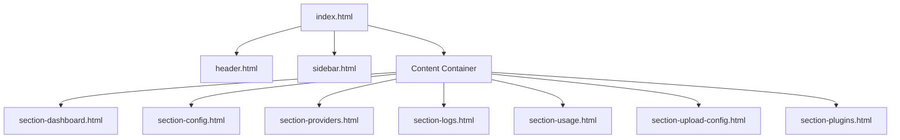

# 页面结构固化与防风控设计文档 (Page Structure & Anti-Risk Design)

## 1. 页面结构层级 (Page Structure Hierarchy)

### 1.1 核心入口 (`index.html`)
采用 SPA (Single Page Application) 模式，通过 `component-loader.js` 动态加载内容。

### 1.2 独立页面
- `login.html`: 登录认证，独立于主框架。
- `potluck.html`: API Key 管理后台 (Admin)。
- `potluck-user.html`: 用户用量查询页 (User)。

## 2. 模块解耦规则 (Decoupling Rules)

1.  **前端-后端解耦**:
    -   前端仅通过 `/api/*` 接口与后端通信。
    -   禁止前端直接读取后端配置文件或数据库文件。
2.  **组件间解耦**:
    -   组件间通信通过全局事件 (`window.dispatchEvent`) 或状态管理模块 (`provider-manager.js`, `config-manager.js`) 进行，不直接操作 DOM。
3.  **静态资源解耦**:
    -   所有第三方库 (Font Awesome) 必须本地化，禁止硬编码外部 CDN 链接。

## 3. 并发控制与防风控策略 (Concurrency Control & Anti-Risk Strategy)

为应对国内用户高并发请求导致海外服务器 IP 被封禁的风险，需在**铺管线阶段**落实以下策略：

### 3.1 后端限流 (Rate Limiting)
- **机制**: 在 `src/handlers/request-handler.js` 中引入**令牌桶 (Token Bucket)** 或 **固定窗口** 限流算法。
- **配置**:
  - `GLOBAL_RATE_LIMIT`: 全局最大并发数 (e.g., 50 req/s)。
  - `IP_RATE_LIMIT`: 单个客户端 IP 限流 (e.g., 10 req/s)。
- **实现**:
  - 请求进入 `requestHandler` 时先检查限流器。
  - 超限请求直接返回 `429 Too Many Requests`，不转发至上游 API。

### 3.2 智能账号轮询与冷却 (Smart Pool Rotation)
- **冷却机制**:
  - 当某个 Provider 账号返回 `429` (Upstream Rate Limit) 或 `403` (Forbidden) 时，自动将其标记为 **"Cooling Down"**。
  - 在接下来的 `N` 分钟内 (e.g., 5-10分钟)，不再调度该账号。
- **随机化**:
  - 轮询策略从 "Round Robin" 改为 "Weighted Random"，避免请求特征过于规律。

### 3.3 请求伪装 (Request Camouflage)
- **User-Agent 随机化**:
  - 在 `src/utils/provider-utils.js` 中维护一个常见浏览器 UA 列表。
  - 转发请求时随机选取 UA，避免被识别为单一脚本流量。
- **Header 净化**:
  - 剔除明显的代理特征 Header (e.g., `X-Forwarded-For` 除非必要，`Via`)。

### 3.4 静态资源优化 (Frontend Optimization)
- **Gzip/Brotli 压缩**:
  - 在 `serveStaticFiles` (`ui-manager.js`) 中启用 Gzip 压缩，减少传输流量，降低延迟，间接减少连接占用时间。
- **强缓存**:
  - 对 `static/app/fontawesome/` 等不常变动的资源设置长效 `Cache-Control`。

## 4. 组件调用规范
- **入参**: 组件加载时不接受 URL 参数，统一通过 API 获取数据。
- **出参**: 组件不直接返回值，通过 DOM 事件通知父容器。
