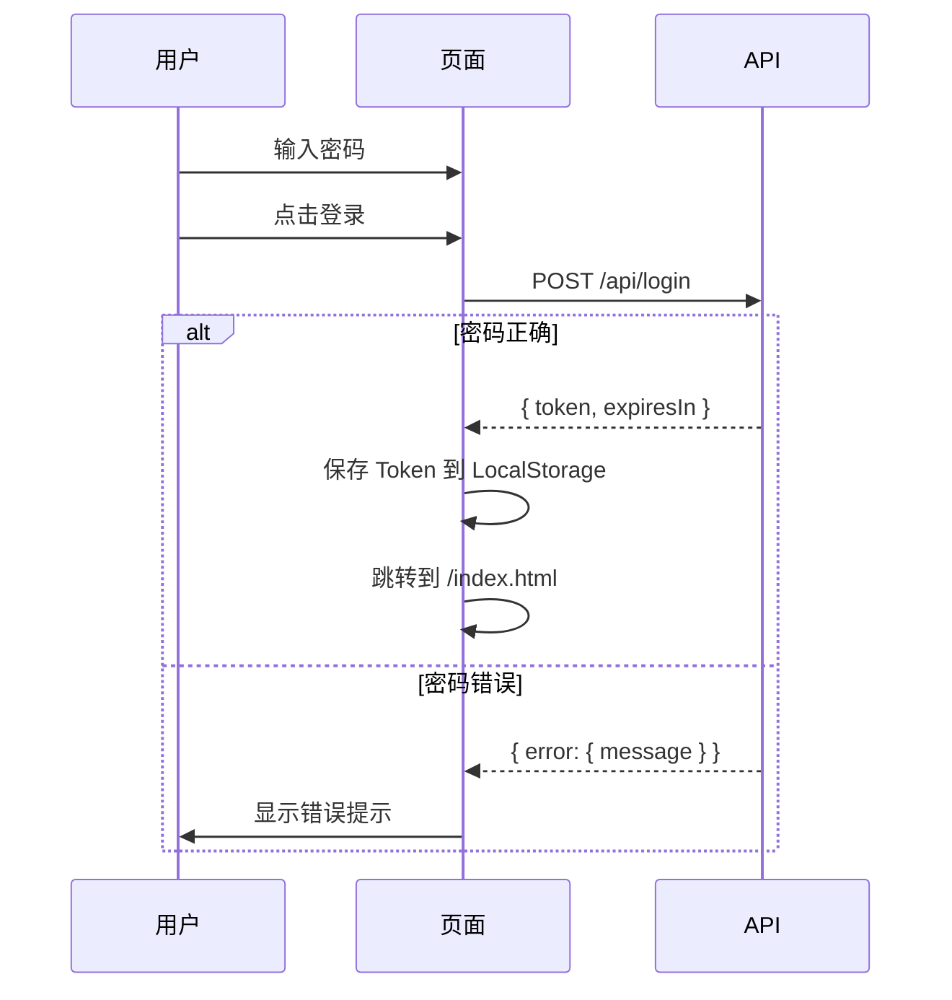
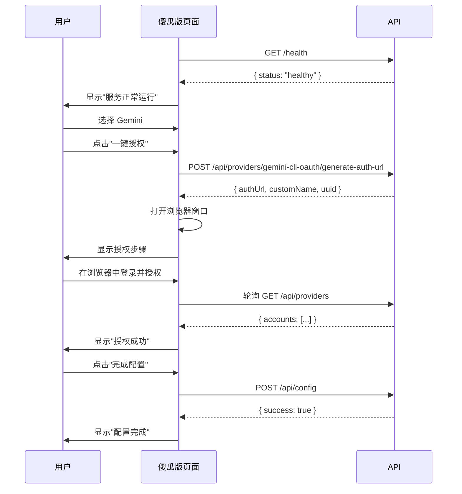
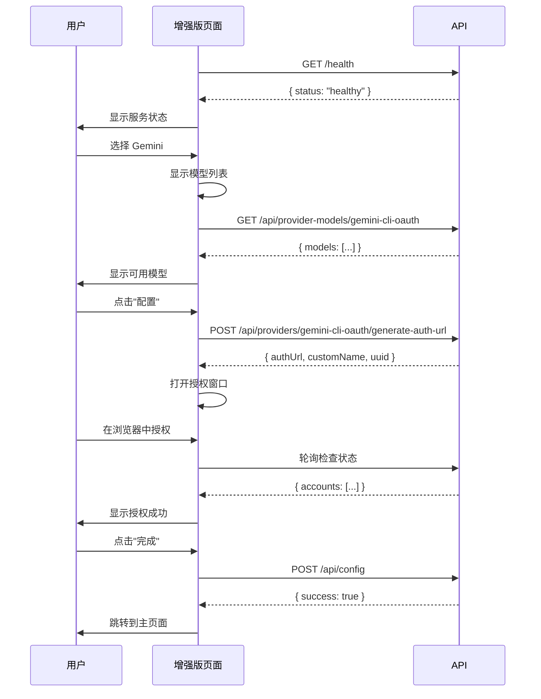
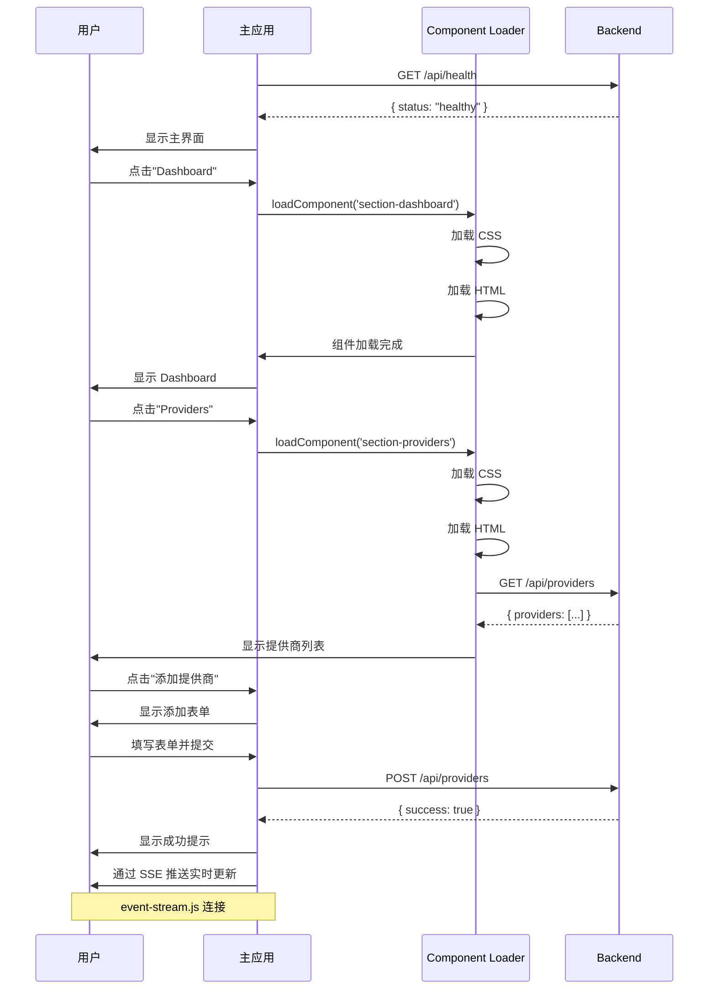
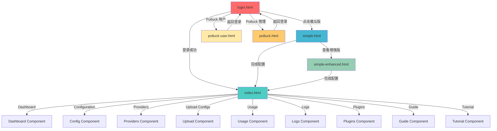

# 页面分析与流程 SOP

> 📋 本文档详细梳理所有页面的功能、组件、API 交互和业务流程。

---

## 📑 目录

1. [页面总览](#页面总览)
2. [登录页详细分析](#登录页详细分析)
3. [傻瓜版详细分析](#傻瓜版详细分析)
4. [傻瓜版增强版详细分析](#傻瓜版增强版详细分析)
5. [主应用详细分析](#主应用详细分析)
6. [Potluck 用户页详细分析](#potluck-用户页详细分析)
7. [Potluck 管理页详细分析](#potluck-管理页详细分析)
8. [页面跳转关系图](#页面跳转关系图)

---

## 🏠 页面总览

### 页面列表

| 页面 | 文件路径 | 功能描述 | 目标用户 |
|------|---------|---------|---------|
| 登录页 | `static/login.html` | 管理员登录 | 管理员 |
| 傻瓜版 | `static/simple.html` | 3步快速配置 | 小白用户 |
| 傻瓜版增强版 | `static/simple-enhanced.html` | 增强版傻瓜界面 | 进阶用户 |
| 主应用 | `static/index.html` | 完整管理界面 | 专业用户 |
| Potluck 用户页 | `static/potluck-user.html` | API Potluck 用户界面 | Potluck 用户 |
| Potluck 管理页 | `static/potluck.html` | API Potluck 管理界面 | Potluck 管理员 |

### 页面功能矩阵

| 功能 | 登录页 | 傻瓜版 | 傻瓜版增强版 | 主应用 | Potluck 用户 | Potluck 管理 |
|------|--------|--------|-------------|--------|-------------|-------------|
| 登录 | ✅ | ❌ | ❌ | ❌ | ❌ | ❌ |
| 配置向导 | ❌ | ✅ | ✅ | ✅ | ❌ | ❌ |
| 提供商管理 | ❌ | ⚠️ 简单 | ⚠️ 中等 | ✅ 完整 | ❌ | ❌ |
| 账号池管理 | ❌ | ❌ | ❌ | ✅ | ❌ | ❌ |
| 使用量查询 | ❌ | ❌ | ❌ | ✅ | ✅ | ✅ |
| 日志查看 | ❌ | ❌ | ❌ | ✅ | ❌ | ❌ |
| 插件管理 | ❌ | ❌ | ❌ | ✅ | ❌ | ❌ |
| 系统管理 | ❌ | ❌ | ❌ | ✅ | ❌ | ❌ |
| 密钥管理 | ❌ | ❌ | ❌ | ❌ | ✅ | ✅ |
| 用户管理 | ❌ | ❌ | ❌ | ❌ | ❌ | ✅ |

---

## 🔐 登录页详细分析

### 页面结构

**文件位置**：`static/login.html:1-391`

**页面布局**：
```
┌─────────────────────────────────┐
│      AI Client 2 API          │
│                                 │
│    ┌─────────────────────┐       │
│    │   Logo              │       │
│    └─────────────────────┘       │
│                                 │
│    ┌─────────────────────┐       │
│    │  管理员登录         │       │
│    │                     │       │
│    │  [密码输入框]       │       │
│    │  ☑ 记住我          │       │
│    │                     │       │
│    │  [登录按钮]         │       │
│    └─────────────────────┘       │
│                                 │
│    [傻瓜版入口]                  │
│                                 │
└─────────────────────────────────┘
```

### 组件引用

**HTML 组件**：
- Logo（`login.html:30-35`）
- 密码输入框（`login.html:43-52`）
- 记住我复选框（`login.html:54-61`）
- 登录按钮（`login.html:63-69`）
- 傻瓜版链接（`login.html:75-80`）

**CSS 样式**：
- 内联样式（`login.html:4-280`）
- 响应式设计
- 渐变背景

**JavaScript 模块**：
- 无独立 JS 文件
- 内联脚本（`login.html:283-391`）

### API 交互

#### 登录接口

**请求**：
```javascript
// login.html:323-329
const response = await fetch('/api/login', {
  method: 'POST',
  headers: { 'Content-Type': 'application/json' },
  body: JSON.stringify({ password: password })
});
```

**请求体**：
```json
{
  "password": "admin123"
}
```

**响应**：
```json
{
  "token": "eyJhbGciOiJIUzI1NiIsInR5cCI6IkpXVCJ9...",
  "expiresIn": 604800
}
```

**错误响应**：
```json
{
  "error": {
    "message": "Invalid password"
  }
}
```

### 业务流程



### SOP 流程

1. **初始化页面**（`login.html:285-293`）
   - 检查 Token 是否存在
   - 如果存在，直接跳转到主页面

2. **用户输入**（`login.html:43-69`）
   - 输入密码
   - 选择是否记住密码

3. **提交登录**（`login.html:323-329`）
   - 验证输入
   - 发送登录请求

4. **处理响应**（`login.html:331-356`）
   - 成功：保存 Token，跳转
   - 失败：显示错误提示

5. **记住密码**（`login.html:358-379`）
   - 如果勾选"记住我"
   - 保存密码到 LocalStorage
   - 下次自动填充

---

## 🚀 傻瓜版详细分析

### 页面结构

**文件位置**：`static/simple.html:1-540`

**页面布局**：
```
┌─────────────────────────────────────┐
│  🌐 服务状态检测                  │
│  ✅ 服务正常运行 / ❌ 服务未启动   │
└─────────────────────────────────────┘

┌─────────────────────────────────────┐
│  推荐服务（免费）                 │
│                                   │
│  ┌───────────────────────────────┐ │
│  │  🤖 Gemini（Google）         │ │
│  │  最简单，推荐新手              │ │
│  │  [一键授权]                  │ │
│  └───────────────────────────────┘ │
│                                   │
│  ┌───────────────────────────────┐ │
│  │  🚀 通义千问（阿里）          │ │
│  │  国内友好，用手机号登录        │ │
│  │  [一键授权]                  │ │
│  └───────────────────────────────┘ │
└─────────────────────────────────────┘

┌─────────────────────────────────────┐
│  其他服务                           │
│                                   │
│  ┌───────────────────────────────┐ │
│  │  💎 Kiro（Claude）           │ │
│  │  [配置指南]                  │ │
│  └───────────────────────────────┘ │
│                                   │
│  ┌───────────────────────────────┐ │
│  │  🔑 OpenAI                   │ │
│  │  [输入 API Key]              │ │
│  └───────────────────────────────┘ │
└─────────────────────────────────────┘
```

### 组件引用

**HTML 组件**：
- 服务状态卡片（`simple.html:35-42`）
- Gemini 卡片（`simple.html:47-54`）
- 通义千问卡片（`simple.html:59-66`）
- Kiro 卡片（`simple.html:71-78`）
- OpenAI 卡片（`simple.html:83-90`）
- 授权模态框（`simple.html:95-150`）
- API Key 输入模态框（`simple.html:155-210`）

**CSS 样式**：
- 内联样式（`simple.html:4-33`）
- 渐变背景
- 卡片式设计
- 响应式布局

**JavaScript 模块**：
- 无独立 JS 文件
- 内联脚本（`simple.html:213-540`）

### API 交互

#### 1. 健康检查

**请求**：
```javascript
// simple.html:320-322
const response = await fetch('/health');
```

**响应**：
```json
{
  "status": "healthy",
  "timestamp": "2026-02-15T12:00:00.000Z",
  "provider": "gemini-cli-oauth"
}
```

#### 2. 生成授权 URL

**请求**：
```javascript
// simple.html:334-342
const response = await fetch(`/api/providers/${providerType}/generate-auth-url`, {
  method: 'POST',
  headers: { 'Content-Type': 'application/json' }
});
```

**响应**：
```json
{
  "authUrl": "https://accounts.google.com/o/oauth2/v2/auth?...",
  "customName": "Gemini OAuth",
  "uuid": "12345678-1234-1234-1234-123456789012"
}
```

#### 3. 检查授权状态

**请求**：
```javascript
// simple.html:352-354
const response = await fetch('/api/providers', {
  method: 'GET'
});
```

**响应**：
```json
{
  "gemini-cli-oauth": {
    "accounts": [
      {
        "customName": "Gemini OAuth",
        "uuid": "12345678-1234-1234-1234-123456789012",
        "enabled": true,
        "healthy": true,
        "errorCount": 0
      }
    ]
  }
}
```

#### 4. 保存配置

**请求**：
```javascript
// simple.html:441-447
const response = await fetch('/api/config', {
  method: 'POST',
  headers: {
    'Content-Type': 'application/json',
    'Authorization': `Bearer ${token}`
  },
  body: JSON.stringify({ MODEL_PROVIDER: providerType })
});
```

**请求体**：
```json
{
  "MODEL_PROVIDER": "gemini-cli-oauth"
}
```

**响应**：
```json
{
  "success": true,
  "message": "Configuration updated successfully"
}
```

### 业务流程



### SOP 流程

#### 步骤 1：服务状态检测（simple.html:320-327）

```javascript
async function checkHealth() {
  try {
    const response = await fetch('/health');
    const data = await response.json();
    updateHealthStatus(data.status === 'healthy');
  } catch (error) {
    updateHealthStatus(false);
  }
}

function updateHealthStatus(isHealthy) {
  const statusElement = document.getElementById('health-status');
  if (isHealthy) {
    statusElement.textContent = '✅ 服务正常运行';
    statusElement.className = 'status-healthy';
  } else {
    statusElement.textContent = '❌ 服务未启动';
    statusElement.className = 'status-unhealthy';
  }
}
```

#### 步骤 2：选择 AI 提供商（simple.html:226-233）

```javascript
function selectProvider(providerType) {
  const providers = {
    gemini: {
      title: '授权 Gemini（Google）',
      desc: '用 Google 账号登录，授权流程最快'
    },
    qwen: {
      title: '授权通义千问（阿里）',
      desc: '用手机号登录，国内友好'
    },
    // ...
  };

  const provider = providers[providerType];
  showAuthModal(provider.title, providerType);
}
```

#### 步骤 3：一键授权（simple.html:329-371）

```javascript
async function startAuth(providerType) {
  // 1. 生成授权 URL
  const response = await fetch(`/api/providers/${providerType}/generate-auth-url`, {
    method: 'POST',
    headers: { 'Content-Type': 'application/json' }
  });
  const { authUrl, customName, uuid } = await response.json();

  // 2. 打开浏览器窗口
  window.open(authUrl, '_blank');

  // 3. 显示授权步骤
  showAuthSteps(customName, uuid);

  // 4. 轮询检查授权状态
  pollAuthStatus(providerType, uuid);
}

async function pollAuthStatus(providerType, uuid) {
  const interval = setInterval(async () => {
    const response = await fetch('/api/providers');
    const data = await response.json();
    const accounts = data[providerType]?.accounts || [];
    const account = accounts.find(a => a.uuid === uuid);

    if (account && account.enabled) {
      clearInterval(interval);
      showAuthSuccess();
    }
  }, 2000); // 每 2 秒检查一次
}
```

#### 步骤 4：保存配置（simple.html:439-458）

```javascript
async function saveConfig(providerType) {
  const token = localStorage.getItem('token') || 'default-token';
  const response = await fetch('/api/config', {
    method: 'POST',
    headers: {
      'Content-Type': 'application/json',
      'Authorization': `Bearer ${token}`
    },
    body: JSON.stringify({ MODEL_PROVIDER: providerType })
  });

  const data = await response.json();
  if (data.success) {
    showSuccessMessage('配置保存成功！');
    // 跳转到主页面
    window.location.href = '/index.html';
  } else {
    showErrorMessage('配置保存失败：' + data.message);
  }
}
```

---

## ✨ 傻瓜版增强版详细分析

### 页面结构

**文件位置**：`static/simple-enhanced.html:1-721`

**页面布局**：
```
┌─────────────────────────────────────┐
│  🌐 服务状态检测                  │
│  ✅ 服务正常运行 / ❌ 服务未启动   │
└─────────────────────────────────────┘

┌─────────────────────────────────────┐
│  选择 AI 提供商                   │
│                                   │
│  ┌───────────────────────────────┐ │
│  │  🤖 Gemini（Google）         │ │
│  │  标签：免费 | 稳定 | 快速      │ │
│  │  模型：gemini-2.0, ...        │ │
│  │  [配置] [使用指南]            │ │
│  └───────────────────────────────┘ │
│                                   │
│  ┌───────────────────────────────┐ │
│  │  🚀 通义千问（阿里）          │ │
│  │  标签：免费 | 国内友好 | 代码强 │ │
│  │  模型：qwen-turbo, ...        │ │
│  │  [配置] [使用指南]            │ │
│  └───────────────────────────────┘ │
│                                   │
│  ┌───────────────────────────────┐ │
│  │  💡 iFlow CLI（多模型）       │ │
│  │  标签：免费 | 多模型 | 超值     │ │
│  │  模型：qwen, kimi, deepseek, ... │ │
│  │  [配置] [使用指南]            │ │
│  └───────────────────────────────┘ │
│                                   │
│  ┌───────────────────────────────┐ │
│  │  🧠 智谱 AI                  │ │
│  │  标签：免费 | 国内领先 | 多模态 │ │
│  │  模型：glm-4, ...             │ │
│  │  [配置] [使用指南]            │ │
│  └───────────────────────────────┘ │
└─────────────────────────────────────┘
```

### 组件引用

**HTML 组件**：
- 服务状态卡片（`simple-enhanced.html:35-42`）
- Gemini 卡片（`simple-enhanced.html:47-66`）
- 通义千问卡片（`simple-enhanced.html:71-90`）
- iFlow 卡片（`simple-enhanced.html:95-114`）
- 智谱卡片（`simple-enhanced.html:119-138`）
- 授权模态框（`simple-enhanced.html:143-210`）
- 模型列表模态框（`simple-enhanced.html:215-280`）

**CSS 样式**：
- 内联样式（`simple-enhanced.html:4-33`）
- 标签样式
- 模型列表样式

**JavaScript 模块**：
- 无独立 JS 文件
- 内联脚本（`simple-enhanced.html:283-721`）

### API 交互

与傻瓜版相同，增加了：

#### 获取模型列表

**请求**：
```javascript
// simple-enhanced.html:344-346
const response = await fetch(`/api/provider-models/${providerType}`);
```

**响应**：
```json
{
  "gemini-cli-oauth": [
    {
      "id": "gemini-2.0-flash-exp",
      "displayName": "Gemini 2.0 Flash (Experimental)"
    },
    {
      "id": "gemini-2.5-pro-exp",
      "displayName": "Gemini 2.5 Pro (Experimental)"
    }
  ]
}
```

### 业务流程



---

## 🏠 主应用详细分析

### 页面结构

**文件位置**：`static/index.html:1-221`

**页面布局**：
```
┌─────────────────────────────────────────┐
│  Header (Logo, Theme Switcher, i18n)  │
├───────────┬───────────────────────────┤
│  Sidebar  │  Main Content            │
│           │                           │
│  Dashboard │  Dashboard Component     │
│  Config    │  - System Info           │
│  Providers │  - Provider Status      │
│  Upload    │  - Recent Logs          │
│  Usage     │                           │
│  Logs      │  Config Component       │
│  Plugins   │  - Provider Management  │
│           │  - Account Pool          │
│  Guide     │  - Proxy Settings       │
│  Tutorial  │                           │
│           │  Providers Component     │
│           │  - Add/Edit/Delete       │
│           │  - Health Check         │
│           │                           │
│           │  Usage Component        │
│           │  - Statistics           │
│           │  - Charts              │
│           │                           │
│           │  Logs Component        │
│           │  - Real-time Logs       │
│           │  - Log Filtering       │
│           │                           │
│           │  Plugins Component     │
│           │  - Enable/Disable      │
│           │  - Plugin Info        │
└───────────┴───────────────────────────┘
```

### 组件引用

**HTML 组件**：
- Header（`index.html:20-30`）
- Sidebar（`index.html:32-45`）
- Main Content（`index.html:47-220`）

**CSS 样式**：
- `static/app/base.css` - 基础样式
- `static/app/mobile.css` - 移动端样式
- `static/components/*.css` - 组件样式

**JavaScript 模块**：
- `static/app/app.js` - 应用入口
- `static/app/auth.js` - 认证管理
- `static/app/component-loader.js` - 组件加载
- `static/app/event-handlers.js` - 事件处理
- `static/app/event-stream.js` - 事件流
- `static/app/config-manager.js` - 配置管理
- `static/app/provider-manager.js` - 提供商管理
- `static/app/usage-manager.js` - 使用量管理
- `static/app/navigation.js` - 导航管理
- `static/app/modal.js` - 模态框
- `static/app/i18n.js` - 国际化
- `static/app/theme-switcher.js` - 主题切换

### API 交互

#### 配置管理

**获取配置**：
```javascript
GET /api/config
Response: { ...config }
```

**更新配置**：
```javascript
POST /api/config
Body: { ...config }
Response: { success: true }
```

**重新加载配置**：
```javascript
POST /api/reload-config
Response: { success: true }
```

#### 提供商管理

**获取提供商列表**：
```javascript
GET /api/providers
Response: { "gemini-cli-oauth": { accounts: [...] } }
```

**添加提供商**：
```javascript
POST /api/providers
Body: {
  "providerType": "gemini-cli-oauth",
  "customName": "My Gemini",
  "credentials": {...}
}
```

**更新提供商**：
```javascript
PUT /api/providers/{type}/{uuid}
Body: { ...updates }
```

**删除提供商**：
```javascript
DELETE /api/providers/{type}/{uuid}
```

**健康检查**：
```javascript
POST /api/providers/{type}/health-check
```

#### 使用量查询

**获取所有使用量**：
```javascript
GET /api/usage
Response: {
  "gemini-cli-oauth": { totalTokens: 100000, totalRequests: 1000 }
}
```

**获取特定提供商使用量**：
```javascript
GET /api/usage/{type}
Response: { totalTokens: 100000, totalRequests: 1000 }
```

#### 日志管理

**下载今日日志**：
```javascript
GET /api/system/download-log
Response: Blob (log file)
```

**清除今日日志**：
```javascript
POST /api/system/clear-log
Response: { success: true }
```

### 业务流程



### SOP 流程

#### 1. 初始化应用（app.js:1-200）

```javascript
async function initApp() {
  // 1. 检查 Token
  const token = localStorage.getItem('token');
  if (!token) {
    window.location.href = '/login.html';
    return;
  }

  // 2. 加载配置
  await loadConfig();

  // 3. 初始化主题
  initTheme();

  // 4. 初始化国际化
  initI18n();

  // 5. 初始化事件流
  initEventStream();

  // 6. 加载默认组件
  loadComponent('section-dashboard');
}

function initEventStream() {
  const eventSource = new EventSource('/api/events');

  eventSource.addEventListener('provider-status', (event) => {
    const data = JSON.parse(event.data);
    updateProviderStatus(data);
  });

  eventSource.addEventListener('config-updated', (event) => {
    const data = JSON.parse(event.data);
    updateConfig(data);
  });
}
```

#### 2. 组件加载（component-loader.js:1-176）

```javascript
async function loadComponent(componentName) {
  // 1. 加载 CSS
  const cssPath = `/static/components/${componentName}.css`;
  await loadCSS(cssPath);

  // 2. 加载 HTML
  const htmlPath = `/static/components/${componentName}.html`;
  const htmlContent = await fetch(htmlPath).then(r => r.text());
  document.getElementById('main-content').innerHTML = htmlContent;

  // 3. 初始化组件
  const initFunction = window[`init${componentName.replace('section-', '').replace('-', '')}Component`];
  if (typeof initFunction === 'function') {
    await initFunction();
  }
}
```

#### 3. 提供商管理（provider-manager.js:1-3370）

```javascript
// 获取提供商列表
async function fetchProviders() {
  const response = await apiRequest('/api/providers', {
    method: 'GET'
  });
  return response;
}

// 添加提供商
async function addProvider(providerType, customName, credentials) {
  const response = await apiRequest('/api/providers', {
    method: 'POST',
    body: JSON.stringify({
      providerType,
      customName,
      credentials
    })
  });
  return response;
}

// 更新提供商
async function updateProvider(providerType, uuid, updates) {
  const response = await apiRequest(`/api/providers/${providerType}/${uuid}`, {
    method: 'PUT',
    body: JSON.stringify(updates)
  });
  return response;
}

// 删除提供商
async function deleteProvider(providerType, uuid) {
  const response = await apiRequest(`/api/providers/${providerType}/${uuid}`, {
    method: 'DELETE'
  });
  return response;
}
```

---

## 💳 Potluck 用户页详细分析

### 页面结构

**文件位置**：`static/potluck-user.html:1-2579`

### API 交互

#### 获取密钥列表

```javascript
GET /api/potluck/keys
Response: {
  "keys": [
    {
      "keyId": "key-123",
      "key": "sk-xxx",
      "usage": { totalTokens: 1000, totalRequests: 10 },
      "quota": { maxTokens: 10000, maxRequests: 100 }
    }
  ]
}
```

#### 生成密钥

```javascript
POST /api/potluck/generate-key
Body: {
  "quota": {
    "maxTokens": 10000,
    "maxRequests": 100
  }
}
Response: {
  "key": "sk-xxx",
  "keyId": "key-123"
}
```

#### 删除密钥

```javascript
DELETE /api/potluck/keys/{keyId}
Response: { success: true }
```

---

## 🎛️ Potluck 管理页详细分析

### 页面结构

**文件位置**：`static/potluck.html:1-1258`

### API 交互

#### 获取用户列表

```javascript
GET /api/potluck/users
Response: {
  "users": [
    {
      "userId": "user-123",
      "username": "user@example.com",
      "keys": [...],
      "usage": {...}
    }
  ]
}
```

#### 删除用户

```javascript
DELETE /api/potluck/users/{userId}
Response: { success: true }
```

---

## 🔗 页面跳转关系图



### 页面说明

| 页面 | 路径 | 说明 |
|------|------|------|
| **login.html** | `/login.html` | 登录页面，所有用户的入口 |
| **index.html** | `/index.html` | 主应用，专业用户使用 |
| **simple.html** | `/simple.html` | 傻瓜版，小白用户使用 |
| **simple-enhanced.html** | `/simple-enhanced.html` | 傻瓜版增强版，进阶用户使用 |
| **potluck-user.html** | `/potluck-user.html` | Potluck 用户界面 |
| **potluck.html** | `/potluck.html` | Potluck 管理界面 |

### 组件说明

| 组件 | 文件 | 说明 |
|------|------|------|
| **Dashboard** | `section-dashboard.html` | 仪表盘，显示系统概览 |
| **Configuration** | `section-config.html` | 配置管理，管理提供商和账号 |
| **Providers** | `section-providers.html` | 提供商管理，添加/编辑/删除提供商 |
| **Upload Configs** | `section-upload-config.html` | 配置文件上传，批量导入配置 |
| **Usage** | `section-usage.html` | 使用量统计，查看使用情况 |
| **Logs** | `section-logs.html` | 日志查看，实时查看系统日志 |
| **Plugins** | `section-plugins.html` | 插件管理，启用/禁用插件 |
| **Guide** | `section-guide.html` | 使用指南，查看使用说明 |
| **Tutorial** | `section-tutorial.html` | 教程，学习如何使用 |

---

## 📊 总结

### 页面功能对比

| 功能复杂度 | 页面 | 适用场景 |
|-----------|------|---------|
| ⭐ 简单 | login.html | 所有用户登录 |
| ⭐⭐ 简单 | simple.html | 小白快速配置 |
| ⭐⭐⭐ 中等 | simple-enhanced.html | 进阶用户配置 |
| ⭐⭐⭐⭐⭐ 复杂 | index.html | 专业用户管理 |
| ⭐⭐⭐⭐ 复杂 | potluck-user.html | Potluck 用户 |
| ⭐⭐⭐⭐⭐ 复杂 | potluck.html | Potluck 管理员 |

### API 调用频率

| 端点 | 页面 | 调用频率 |
|------|------|---------|
| `POST /api/login` | login.html | 用户登录时 |
| `GET /health` | 所有页面 | 初始化时 |
| `GET /api/config` | 所有页面 | 初始化时 |
| `GET /api/providers` | simple*, index.html | 初始化和更新时 |
| `POST /api/providers/{type}/generate-auth-url` | simple* | 配置时 |
| `GET /api/events` | index.html | 实时（SSE） |
| `GET /api/usage` | index.html, potluck-user.html | 查看使用量时 |

### 推荐使用路径

**小白用户**：
```
login.html → simple.html → index.html（可选）
```

**进阶用户**：
```
login.html → simple-enhanced.html → index.html
```

**专业用户**：
```
login.html → index.html
```

**Potluck 用户**：
```
login.html → potluck-user.html
```

**Potluck 管理员**：
```
login.html → potluck.html
```

---

**文档版本**：v1.0.0
**最后更新**：2026-02-15
**维护者**：AIClient-2-API Team
