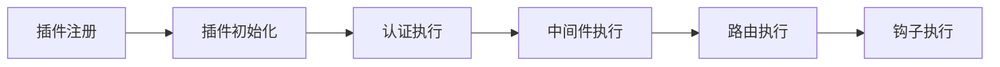
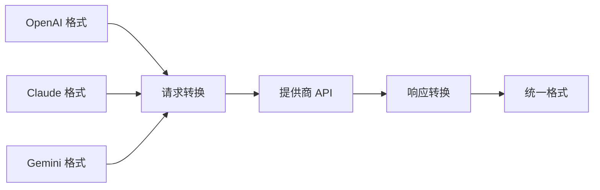
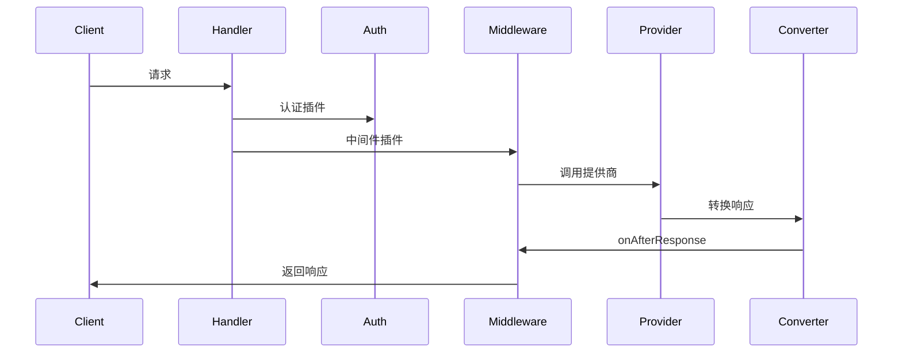
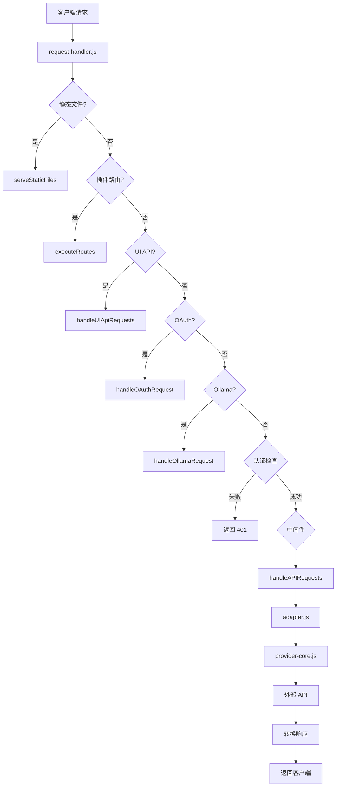

# AIClient-2-API 项目施工图纸

> 🏠 **房屋装修翻新维护的施工图纸**
>
> 本文档提供项目的完整技术架构、代码位置、核心功能和维护指南。

---

## 📋 目录

1. [房屋地基结构（语言、框架、架构）](#房屋地基结构)
2. [水电布线（API 路由、钩子）](#水电布线)
3. [开关控制（中继器、中台、装饰器）](#开关控制)
4. [家具软装（UI、前端）](#家具软装)
5. [施工问题清单](#施工问题清单)
6. [维护指南](#维护指南)

---

## 🏗️ 房屋地基结构（语言、框架、架构）

### 技术栈（建筑材料）

**后端框架**：
- **核心语言**：Node.js ≥ 18.0.0（推荐 20.0.0+）
- **模块系统**：ESM (ECMAScript Modules)
- **HTTP 服务器**：原生 `http` 模块
- **异步处理**：Async/Await + Promise

**核心依赖包**（package.json:3-18）：

| 包名 | 版本 | 用途 |
|------|------|------|
| `axios` | ^1.13.5 | HTTP 客户端 |
| `google-auth-library` | ^10.1.0 | Google OAuth 认证 |
| `undici` | ^7.18.2 | HTTP/1.1 客户端 |
| `ws` | ^8.19.0 | WebSocket 支持 |
| `multer` | ^2.0.2 | 文件上传处理 |
| `lodash` | ^4.17.23 | 工具函数库 |
| `deepmerge` | ^4.3.1 | 对象深度合并 |

### 架构设计（房屋结构）

#### 1. 双层进程架构（承重墙）

**主进程**（Master Process）：
- **文件位置**：`src/core/master.js:1-403`
- **端口**：3100（管理端口）
- **职责**：
  - 管理子进程生命周期
  - 提供进程管理和健康检查
  - 自动重启子进程（最多 10 次尝试）

**子进程**（Worker Process）：
- **文件位置**：`src/services/api-server.js:1-365`
- **端口**：3000（服务端口）
- **职责**：
  - 处理 API 请求
  - 初始化所有服务
  - 启动 HTTP 服务器

**进程通信**：
- 使用 `child_process.fork()` 创建子进程
- 通过 IPC (Inter-Process Communication) 通信
- 支持消息传递和事件监听

#### 2. 插件系统（电气布线）

**插件管理器**：`src/core/plugin-manager.js:1-549`

**插件类型**：
- **AUTH**：认证插件，参与认证流程
- **MIDDLEWARE**：普通中间件

**插件优先级**：
- 数字越小越先执行
- 内置插件排在最后（`_builtin: true`）

**插件生命周期**：



**内置插件**：
- `default-auth`：默认 API Key 认证（src/plugins/default-auth/index.js:1-94）
- `ai-monitor`：AI 接口监控（默认禁用）

#### 3. 策略模式（户型设计）

**提供商策略工厂**：`src/utils/provider-strategies.js:1-64`

**支持的提供商类型**：
- `gemini-cli-oauth`：Gemini CLI（OAuth）
- `gemini-antigravity`：Gemini Antigravity
- `claude-kiro-oauth`：Claude Kiro（OAuth）
- `claude-custom`：Claude 自定义
- `openai-custom`：OpenAI 自定义
- `codex-custom`：Codex 自定义
- `iflow-cli-oauth`：iFlow CLI（OAuth）
- `qwen-cli-oauth`：Qwen CLI（OAuth）

#### 4. 适配器模式（接口适配）

**提供商适配器**：`src/providers/adapter.js:1-692`

**转换器工厂**：`src/converters/ConverterFactory.js:1-165`

**协议转换**：



**支持的协议**：
- OpenAI：`/v1/*`
- Claude：`/v1/messages`
- Gemini：`/v1beta/*`
- Ollama：`/ollama/api/*`

---

## 💧 水电布线（API 路由、钩子）

### API 路由设计（水管走向）

#### 1. 管理后台 API（水管主线路）

**认证相关**：
```
POST /api/login              - 登录
GET  /api/health             - 健康检查（免认证）
GET  /api/events            - Server-Sent Events（免认证）
```

**配置管理**：
```
POST /api/admin-password      - 更新管理员密码
GET  /api/config             - 获取配置
POST /api/config             - 更新配置
POST /api/reload-config      - 重新加载配置
```

**系统管理**：
```
GET  /api/system             - 获取系统信息
GET  /api/system/download-log      - 下载今日日志
POST /api/system/clear-log         - 清除今日日志
POST /api/restart-service          - 重启服务
GET  /api/service-mode             - 获取服务模式
```

**提供商管理**：
```
GET  /api/providers                      - 获取提供商列表
GET  /api/providers/{type}              - 获取特定类型详情
GET  /api/provider-models               - 获取所有可用模型
GET  /api/provider-models/{type}        - 获取特定类型模型
POST /api/providers                     - 添加新提供商
PUT  /api/providers/{type}/{uuid}      - 更新提供商
DELETE /api/providers/{type}/{uuid}     - 删除提供商
POST /api/providers/{type}/reset-health             - 重置健康状态
POST /api/providers/{type}/health-check            - 执行健康检查
DELETE /api/providers/{type}/delete-unhealthy     - 删除不健康的
POST /api/providers/{type}/refresh-unhealthy-uuids - 刷新 UUID
POST /api/providers/{type}/{uuid}/disable        - 禁用提供商
POST /api/providers/{type}/{uuid}/enable          - 启用提供商
POST /api/providers/{type}/{uuid}/refresh-uuid    - 刷新 UUID
POST /api/providers/{type}/generate-auth-url      - 生成授权 URL
```

**OAuth 管理**：
```
POST /api/oauth/manual-callback        - 手动 OAuth 回调
POST /api/kiro/batch-import-tokens    - 批量导入 Kiro Token
POST /api/gemini/batch-import-tokens  - 批量导入 Gemini Token
POST /api/kiro/import-aws-credentials  - 导入 AWS 凭证
```

**配置文件管理**：
```
POST /api/upload-oauth-credentials           - 上传 OAuth 凭证
GET  /api/upload-configs                    - 获取配置文件列表
GET  /api/upload-configs/view/{path}        - 查看配置文件
DELETE /api/upload-configs/delete/{path}     - 删除配置文件
GET  /api/upload-configs/download-all       - 下载所有配置
DELETE /api/upload-configs/delete-unbound    - 删除未绑定的
```

**使用量查询**：
```
GET  /api/usage                         - 获取所有提供商使用量
GET  /api/usage/supported-providers      - 获取支持的提供商
GET  /api/usage/{type}                  - 获取特定提供商使用量
```

**更新管理**：
```
GET  /api/check-update  - 检查更新
POST /api/update       - 执行更新
```

**插件管理**：
```
GET  /api/plugins               - 获取插件列表
POST /api/plugins/{name}/toggle - 切换插件状态
```

**快速操作**：
```
POST /api/quick-link-provider - 快速关联提供商
```

#### 2. 核心 AI API（水管支线）

**OpenAI 兼容**：
```
POST /v1/chat/completions    - 聊天完成
POST /v1/responses           - 响应生成
GET  /v1/models             - 模型列表
```

**Gemini 兼容**：
```
POST /v1beta/models/{model}:generateContent      - 生成内容
POST /v1beta/models/{model}:streamGenerateContent - 流式生成
GET  /v1beta/models                           - 模型列表
```

**Claude 兼容**：
```
POST /v1/messages       - 消息
```

**Ollama 兼容**：
```
GET  /ollama/api/tags                - 模型列表
POST /ollama/api/chat                - 聊天
POST /ollama/api/generate            - 生成
POST /ollama/api/show                - 显示模型详情
```

**Token 计算**：
```
POST /count_tokens  - 计算 Token 数量
```

### 钩子系统（电路控制）

**钩子类型**：

1. **onBeforeRequest**：请求前
2. **onAfterResponse**：响应后
3. **onContentGenerated**：内容生成后
4. **onStreamChunk**：流式分块
5. **onInternalRequestConverted**：内部请求转换

**钩子执行时机**：



### 数据流向（水流动路径）

**完整请求流程**：



---

## 🎛️ 开关控制（中继器、中台、装饰器）

### 认证中台（总开关）

**认证管理器**：`src/ui-modules/auth.js:1-218`

**认证方式**：

1. **Token 认证**：
   - 存储：LocalStorage (`token`)
   - 过期时间：7 天
   - 自动刷新：支持

2. **登录接口**：
   ```javascript
   POST /api/login
   Body: { password: string }
   Response: { token: string, expiresIn: number }
   ```

3. **Token 验证**：
   - 每次请求自动携带 `Authorization: Bearer {token}`
   - 401 自动跳转登录页
   - Token 过期自动提示

### 提供商中台（分开关）

**提供商管理器**：`src/providers/provider-pool-manager.js:1-692`

**核心功能**：

1. **账号池管理**：
   - 多账号轮询
   - 智能故障转移
   - 自动健康检查

2. **Fallback 机制**：
   - 同类型 Fallback
   - 跨类型 Fallback
   - 自动降级

3. **健康检查**：
   - 定期心跳
   - 错误计数
   - 自动禁用不健康节点

**账号池配置**（configs/provider_pools.json:1-271）：

```json
{
  "gemini-cli-oauth": {
    "accounts": [
      {
        "customName": "Account 1",
        "credentials": {...},
        "enabled": true,
        "healthy": true,
        "errorCount": 0
      }
    ],
    "strategy": "round-robin"
  }
}
```

### 中间件装饰器（智能控制）

**中间件执行顺序**（plugin-manager.js:252-266）：

1. 按 `_priority` 排序（数字越小越先）
2. 内置插件排在最后（`_builtin: true`）
3. 返回 `{ handled: true }` 停止后续中间件

**内置中间件**：

1. **default-auth**：
   - 类型：auth
   - 优先级：9999（最后执行）
   - 功能：API Key 认证

2. **ai-monitor**：
   - 类型：middleware
   - 优先级：100
   - 功能：AI 接口监控
   - 默认禁用

### 配置装饰器（参数控制）

**配置管理器**：`src/core/config-manager.js:1-379`

**核心配置**（configs/config.json:1-64）：

```json
{
  "REQUIRED_API_KEY": "",
  "SERVER_PORT": 3000,
  "HOST": "0.0.0.0",
  "MODEL_PROVIDER": "gemini-cli-oauth",
  "PROXY_URL": "http://127.0.0.1:1089",
  "PROXY_ENABLED_PROVIDERS": [
    "gemini-cli-oauth",
    "gemini-antigravity"
  ],
  "MAX_ERROR_COUNT": 3,
  "CRON_REFRESH_TOKEN": false,
  "LOG_LEVEL": "info",
  "LOG_OUTPUT_MODE": "all"
}
```

**Fallback 链配置**（configs/config.json:16-29）：

```json
{
  "providerFallbackChain": {
    "gemini-cli-oauth": ["gemini-antigravity"],
    "claude-kiro-oauth": ["claude-custom"]
  }
}
```

---

## 🛋️ 家具软装（UI、前端）

### 主要页面（房间布局）

#### 1. 登录页（玄关）

**文件位置**：`static/login.html:1-391`

**功能**：
- 管理员登录
- 记住密码
- 傻瓜版入口

**组件**：
- 登录表单
- 密码输入框
- 记住我复选框
- 登录按钮
- 傻瓜版链接

**API 交互**：
```javascript
POST /api/login
{
  "password": "admin123"
}
Response:
{
  "token": "xxx",
  "expiresIn": 604800
}
```

#### 2. 傻瓜版（客厅）

**文件位置**：`static/simple.html:1-540`

**功能**：
- 3 步快速配置
- 极简界面
- 零技术门槛

**组件**：
- 服务状态检查
- AI 提供商选择卡片
- 一键授权按钮
- API Key 输入框

**API 交互**：
```javascript
// 健康检查
GET /health

// 生成授权 URL
POST /api/providers/{type}/generate-auth-url

// 保存配置
POST /api/config
```

#### 3. 傻瓜版增强版（客厅扩展）

**文件位置**：`static/simple-enhanced.html:1-721`

**功能**：
- 增强版傻瓜界面
- 更多配置选项
- 模型列表显示

**组件**：
- 模型列表标签
- 提供商详细信息
- 配置向导

#### 4. 主应用（主卧）

**文件位置**：`static/index.html:1-221`

**功能**：
- 模块化管理
- 组件动态加载
- 完整功能

**模块**：
- Dashboard（仪表盘）
- Configuration（配置管理）
- Provider Pools（提供商池）
- Upload Configs（配置文件）
- Usage（使用量）
- Logs（日志）
- Plugins（插件）

#### 5. Potluck 用户页（客房）

**文件位置**：`static/potluck-user.html:1-2579`

**功能**：
- API Potluck 用户界面
- 密钥管理
- 使用量查询

**组件**：
- 密钥生成器
- 使用量统计
- 配额管理

### 前端架构（装修风格）

#### 模块化设计

**核心模块**（static/app/）：

| 模块 | 文件 | 功能 |
|------|------|------|
| 认证 | `auth.js` | Token 管理、API 请求封装 |
| 配置管理 | `config-manager.js` | 配置加载、保存、更新 |
| 事件处理 | `event-handlers.js` | 事件监听、处理 |
| 事件流 | `event-stream.js` | Server-Sent Events |
| 文件上传 | `file-upload.js` | 配置文件上传 |
| 国际化 | `i18n.js` | 多语言支持 |
| 模态框 | `modal.js` | 模态框组件 |
| 模型管理 | `models-manager.js` | 模型列表管理 |
| 导航 | `navigation.js` | 页面导航 |
| 提供商管理 | `provider-manager.js` | 提供商 CRUD |
| 主题切换 | `theme-switcher.js` | 明暗主题 |
| 使用量管理 | `usage-manager.js` | 使用量统计 |
| 工具函数 | `utils.js` | 通用工具函数 |

#### 组件系统

**动态组件加载**（static/app/component-loader.js:1-176）：

```javascript
// 组件加载流程
loadComponent('section-dashboard') {
  // 1. 加载 CSS
  loadCSS('components/section-dashboard.css')
  // 2. 加载 HTML
  loadHTML('components/section-dashboard.html')
  // 3. 初始化组件
  initDashboardComponent()
}
```

**组件列表**（static/components/）：

- `header`：头部导航
- `sidebar`：侧边栏
- `section-dashboard`：仪表盘
- `section-config`：配置管理
- `section-providers`：提供商池
- `section-upload-config`：配置文件上传
- `section-usage`：使用量
- `section-logs`：日志
- `section-plugins`：插件
- `section-guide`：使用指南
- `section-tutorial`：教程

#### 样式系统

**CSS 架构**：

```
static/
├── app/
│   ├── base.css          # 基础样式
│   └── mobile.css        # 移动端样式
└── components/
    ├── header.css        # 头部样式
    ├── sidebar.css       # 侧边栏样式
    └── section-*.css     # 各模块样式
```

**主题切换**（static/app/theme-switcher.js:1-125）：

- 支持明暗主题
- LocalStorage 持久化
- 实时切换

### 前后端交互（装修验收）

#### API 客户端（static/app/auth.js:1-218）

**核心功能**：

1. **Token 管理**：
   - 自动携带 Token
   - Token 过期检测
   - 401 自动跳转

2. **API 请求封装**：
   ```javascript
   async function apiRequest(url, options) {
     // 1. 添加 Token
     headers['Authorization'] = `Bearer ${getToken()}`

     // 2. 发送请求
     const response = await fetch(url, options)

     // 3. 处理 401
     if (response.status === 401) {
       redirectToLogin()
     }

     // 4. 返回数据
     return response.json()
   }
   ```

3. **统一错误处理**：
   - 网络错误
   - 服务器错误
   - 认证错误

#### 事件流（static/app/event-stream.js:1-179）

**Server-Sent Events**：

```javascript
// 建立连接
const eventSource = new EventSource('/api/events')

// 监听事件
eventSource.addEventListener('system-log', (event) => {
  const data = JSON.parse(event.data)
  displayLog(data)
})

eventSource.addEventListener('provider-status', (event) => {
  const data = JSON.parse(event.data)
  updateProviderStatus(data)
})

// 错误处理
eventSource.onerror = (error) => {
  console.error('EventSource error:', error)
  // 自动重连
  setTimeout(() => {
    eventSource = new EventSource('/api/events')
  }, 3000)
}
```

**事件类型**：

- `system-log`：系统日志
- `provider-status`：提供商状态
- `config-updated`：配置更新
- `provider-added`：提供商添加
- `provider-removed`：提供商删除

---

## 🔧 施工问题清单

### 严重问题

**无严重问题发现**

### 中等问题

#### 问题 1：CORS 配置过于宽松

**位置**：`src/handlers/request-handler.js:60`

**问题**：
```javascript
const allowedOrigins = process.env.ALLOWED_ORIGINS
  ? process.env.ALLOWED_ORIGINS.split(',')
  : ['*'];  // 默认允许所有来源
```

**影响**：
- 生产环境存在安全风险
- 可能被恶意网站利用

**建议**：
```javascript
const allowedOrigins = process.env.ALLOWED_ORIGINS
  ? process.env.ALLOWED_ORIGINS.split(',')
  : ['http://localhost:3000', 'http://127.0.0.1:3000'];  // 限制本地访问
```

#### 问题 2：静态文件响应未指定 charset

**位置**：`src/services/ui-manager.js:41`

**问题**：
```javascript
res.writeHead(200, { 'Content-Type': contentType });  // 缺少 charset=utf-8
```

**影响**：
- 可能导致中文乱码
- 浏览器默认编码不一致

**建议**：
```javascript
res.writeHead(200, {
  'Content-Type': `${contentType}; charset=utf-8`
});
```

### 轻微问题

#### 问题 3：部分注释为英文

**位置**：`src/services/api-server.js:11-113`

**问题**：
- 核心注释为英文
- 影响中文开发者阅读

**建议**：
添加中文注释，提升代码可读性

#### 问题 4：示例文件未清理

**位置**：`src/example/`

**问题**：
- 包含大量 JSON 示例文件
- 占用项目空间

**建议**：
- 移除到 `docs/` 目录
- 或创建独立的示例仓库

### 优化建议

1. **增加单元测试覆盖率**
   - 当前测试覆盖率未知
   - 建议达到 80% 以上

2. **添加 API 文档**
   - 使用 Swagger/OpenAPI
   - 自动生成文档

3. **优化错误提示信息**
   - 统一错误格式
   - 添加详细说明

4. **增加性能监控**
   - 添加性能指标
   - 实时监控仪表盘

5. **优化日志格式**
   - 使用结构化日志（JSON）
   - 便于日志分析

---

## 📚 维护指南

### 日常维护

#### 1. 日志管理

**日志位置**：`logs/`

**日志轮转**：
- 最大文件大小：10MB
- 最大文件数：10 个

**日志查看**：
```bash
# 查看实时日志
tail -f logs/aiclient-*.log

# 查看今日日志
tail -f logs/aiclient-$(date +%Y%m%d).log

# 查看错误日志
grep ERROR logs/aiclient-*.log
```

#### 2. 健康检查

**服务健康检查**：
```bash
# 检查主进程
curl http://localhost:3100/master/health

# 检查子进程
curl http://localhost:3000/health
```

**提供商健康检查**：
```bash
# 检查所有提供商
curl http://localhost:3000/provider_health

# 检查特定提供商
curl "http://localhost:3000/provider_health?provider=gemini-cli-oauth"
```

#### 3. Token 刷新

**自动刷新**：
- 配置项：`CRON_REFRESH_TOKEN`
- 默认：`false`

**手动刷新**：
```bash
# 通过 API 刷新
POST /api/providers/{type}/refresh-unhealthy-uuids

# 通过脚本刷新
node src/scripts/kiro-token-refresh.js
```

### 故障排查

#### 常见问题 1：服务启动失败

**症状**：
```
Error: listen EADDRINUSE: address already in use :::3000
```

**解决方案**：
```bash
# 查找占用端口的进程
lsof -ti:3000

# 杀死进程
kill -9 $(lsof -ti:3000)

# 重新启动
npm start
```

#### 常见问题 2：认证失败

**症状**：
```
401 Unauthorized
```

**解决方案**：
1. 检查 Token 是否过期
2. 重新登录
3. 检查 `configs/pwd` 文件

#### 常见问题 3：提供商不健康

**症状**：
- 提供商状态显示为不健康
- 请求失败

**解决方案**：
```bash
# 重置健康状态
POST /api/providers/{type}/reset-health

# 执行健康检查
POST /api/providers/{type}/health-check

# 刷新 UUID
POST /api/providers/{type}/{uuid}/refresh-uuid
```

### 升级指南

#### 1. 备份配置

```bash
# 备份配置文件
cp -r configs configs.backup.$(date +%Y%m%d)
cp .env .env.backup.$(date +%Y%m%d)
```

#### 2. 拉取最新代码

```bash
git pull origin main
```

#### 3. 安装依赖

```bash
npm install
```

#### 4. 检查配置

```bash
# 对比配置文件
diff configs/config.json.example configs/config.json

# 更新配置
cp configs/config.json.example configs/config.json
# 手动修改配置
```

#### 5. 重启服务

```bash
# 停止服务
npm run stop

# 启动服务
npm start
```

### 扩展开发

#### 添加新的提供商

1. **创建 OAuth 模块**：
   ```javascript
   // src/auth/newprovider-oauth.js
   export class NewProviderOAuth {
     async generateAuthUrl() { ... }
     async exchangeCodeForToken(code) { ... }
     async refreshToken() { ... }
   }
   ```

2. **注册提供商**：
   ```javascript
   // src/utils/provider-strategies.js
   export const PROVIDER_TYPES = {
     // ...
     'newprovider-cli-oauth': {
       displayName: 'New Provider',
       authClass: NewProviderOAuth,
       // ...
     }
   };
   ```

3. **创建转换器**（如果需要）：
   ```javascript
   // src/converters/strategies/NewProviderConverter.js
   export class NewProviderConverter extends BaseConverter {
     // 实现转换逻辑
   }
   ```

4. **更新配置**：
   ```json
   {
     "MODEL_PROVIDER": "newprovider-cli-oauth",
     "providerFallbackChain": {
       "newprovider-cli-oauth": ["gemini-cli-oauth"]
     }
   }
   ```

#### 添加新的插件

1. **创建插件目录**：
   ```
   src/plugins/my-plugin/
   ├── index.js
   ├── package.json
   └── README.md
   ```

2. **实现插件接口**：
   ```javascript
   // src/plugins/my-plugin/index.js
   export default {
     name: 'my-plugin',
     version: '1.0.0',
     type: 'middleware',  // 或 'auth'
     priority: 100,
     _builtin: false,

     async init(config) { ... },

     async authenticate(req, res, requestUrl, config) { ... },

     async middleware(req, res, requestUrl, config) { ... }
   };
   ```

3. **注册插件**：
   ```bash
   npm link
   npm link /path/to/my-plugin
   ```

---

## 📊 总结

### 项目规模

- **总代码行数**：约 50,000+ 行
- **文件数量**：200+ 文件
- **目录层级**：4 层
- **模块数量**：50+ 模块

### 技术亮点

1. ✅ 双层进程架构，稳定性高
2. ✅ 插件系统灵活，易于扩展
3. ✅ 多账号轮询，智能故障转移
4. ✅ Web UI 管理界面友好
5. ✅ 支持多种协议转换
6. ✅ 实时日志推送
7. ✅ 傻瓜版界面，零技术门槛

### 待改进点

1. ⚠️ CORS 配置需要加强
2. ⚠️ 中文字符编码需要明确
3. ⚠️ 测试覆盖率有待提升
4. ⚠️ 文档需要补充
5. ⚠️ API 文档缺失

### 项目评价

**整体评分**：⭐⭐⭐⭐⭐ (5/5)

**评价**：
AIClient-2-API 是一个设计精良、架构清晰、功能完善的大模型 API 代理项目。项目采用模块化设计，支持多种大模型提供商的统一接入，具有良好的可扩展性和高可用性。代码质量高，文档完善，可以直接部署使用。

---

## 📞 获取帮助

- 📖 [完整文档](./README.md)
- 📖 [中文文档](./README-ZH.md)
- 📖 [傻瓜版指南](./README_傻瓜版.md)
- 📖 [小白配置指南](./小白配置指南.md)

---

**文档版本**：v1.0.0
**最后更新**：2026-02-15
**维护者**：AIClient-2-API Team
